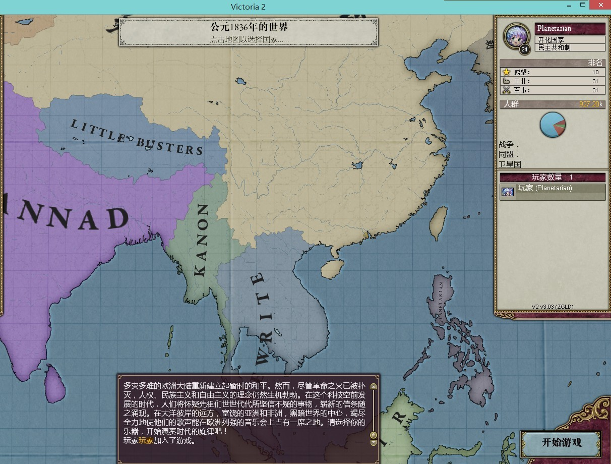

# The SAIMOE project of Victoria II 3.03 Heart of Darkness

算了我也不擅长起名字 就这样把

这是本计划的github托管仓库 欢迎有意者加入本计划，交pull request，交issue什么的都是人民群众喜闻乐见的事情，或者也可以直接联系任意制作组成员，也非常欢迎加群124232634讨论

如何交issue：本页面最上方有个issues，点击然后点右边绿色的new issue即可。貌似需要注册一个github帐号（反正是免费的）

## 文案

 要一个语文几乎挂科的人写文案真是强人所难。。。请直接往下看

## 系统简介

以下只是构想的嘴炮 还没有付诸实践= =

### 总纲

本游戏并不反映史实；所有和史实有雷同的部分，纯属巧合。

请注意：本游戏是一个 **萌战** MOD，而不是一个 **国家萌化** MOD。

例如，**蔷薇少女的位置和毛子一样，并非因为毛子喜欢看蔷薇少女** （事实上，据统计，毛子特别偏爱的都是例如贤狼啊这种人物），而是因为 **毛子居于大陆岛之中心，天然是旧秩序的维护者，以及前期最大的压路机** （蔷薇有萌战票仓之称），正如蔷薇在日萌中的地位。

在这个游戏中， **人民** 是 **粉丝** 的象征，而 **国家** 是 **人物党派、作品和阵营** 的象征。例如，作品党争不断，则相当于国家军阀混战。 

**宗教** 没有意义，所有的宗教事件都会删除（或者仅有搞笑效果，比如所有的东方国家都信仰东正教（笑））。

**党派** 在大多数国家中都是模版脸，仅在少数国家中有不同，例如魔炮大妈奈叶家的保守党奈叶厨是沙文道德居留保护国资，（顺带一提反动党也是奈叶厨）

**民族** 地位和国家一样。例如如果冬马和纱兼并了小木增雪菜而成立了叶社（注意叶社并不是一个union flag），那么由于这样成立（通过change tag成立）的叶社是不接受（作为一个民族的）雪菜党的，那么不可接受的雪菜党当然不会被征召为高级兵种，不可被动员，而且喜欢闹独立。

**事件和决议** 分为两部分，一部分是史实引起的事件和决议，随国家不同而不同， ~~例如白学家就一定会内战；~~ 另一部分是通用的萌战系统，这个系统包括若干新CB，以及一套事件组。

**剧本** 史实的萌战事件将通过剧本（确切的说是bookmark）来体现。例如，如果您选择了09剧本（例如bookmark叫做1900.1.1反京都同盟），京都一开场就是爆恶名被全世界宣遏制的状态；但是如果您选择了其他剧本，京都在08年以AI的尿性很可能不爆恶名（甚至连京键同盟都不一定签署），自然没有反京都同盟发生。再说反京都同盟也并不是一个事件，只是京都爆恶名的表现。整个萌战事件组所强制发生的，只不过是一套萌战系统而已。关于这套系统的介绍，参见下文。

在1836年的大战役剧本中，您可以选择不发生史实事件，但是我非常不建议这么做。

**科技** 尚未决定是否萌化。

### 国家事件和国家CB

TODO；这正是招新的重要一部分 毕竟这里列举的动漫 我有不少都没看过 比如轻音我就没看过

### 移民

在不同的作品间来回转移，这是动漫的特点。基于此，本游戏中移民的比例将会大大增加。要知道，即使是全核心大德，当全核心大德被吸干到只剩下2M人的时候，也只不过是个战4渣，甚至打不过阿尔及利亚。

日萌终将衰落，而世萌终将崛起：从旧大陆到新大陆的移民趋势是无法阻挡的。然而优秀的作品，即使历尽时代的淘洗，即使成为所谓时泪，其人口增长速度也大于移民速度，甚至可以吸引移民；反之。

某些特定的作品——比如白学——由于其“脱宅神作”的属性，虽然吸引移民的能力不强，但是人民移民的意愿大大降低。

而萌战的作用，也主要通过改变移民吸引和移民意愿来表现。

### 萌战

刻画萌战是本mod的主题之一。

#### 日萌

在特定的年份（以1840为2005年萌战开始的日子，之后每X年一次，X尚未决定），会设定一个全球变量“XX年日萌开始”；

在史实剧本中，在当年史实中参赛的各作品会被挂上国家变量“参加XX年日萌”。如果两个国家都有这个变量，那么就能0BB宣“萌战”CB。这个CB包括威望的改变，以及胜者增加移民吸引力，败者减小。

系统将维护一个全球变量的计数器来统计尚未被淘汰的作品。当只剩下四个的时候会开始半决赛和决赛，战争的双方将由事件被强制触发。双方正在进行的其他战争将被强制和平。

获得四强、准萌和萌王，会给你持续五年的，移民吸引力修正buff。另外，萌王由于怨念的关系，会额外的吃一些BB。如果因此爆了BB，大家当然可以随便制裁它。

鉴于AI的战争经常一打几十年，所以萌战如果打的时间长了（比如超过五年）会疯狂往两边刷厌战（玩家罪加一等）。当某一年的萌王决出之后，会上一个全球变量“XX年日萌结束”，然后下一年日萌才有可能开始。

#### 世萌

一旦有人爆过BB（啊对啦 史实中是08年的京都），或者时间到达了2011年，将会有美国友人因为看不下去日萌的黑暗而举办世萌。

世萌是完全比拼威望（人气）的比赛，而不是通过CB实现。世萌的四强、准萌和萌王也有和日萌一样的效果。对啦，玩家的威望debuff非常严重哟。

世萌的影响力是随着时间逐渐提升的。一开始世萌几乎没有什么影响力。

#### 日萌剧本组（部分命名参考了泄矢青蛙子吧（蛙吧）妖娆魂魄大大的萌战无双313版）

 话说天下大势,分久必合,合久必分。

自叶社、键社以来，死宅猖獗，天下纷争。社稷有累卵之危，生灵有倒悬之急。 我太祖樱皇帝，扫清六合，席卷八荒；万姓倾心，四方仰德。自非以权势取之，实乃天命所归也。 我世祖梨皇帝，神文圣武，继承大统，应天合人，法尧禅舜，处日本一只王(第四声)八。

——大萌传三世而亡。

注意：以下都是 **剧本下的史实事件** ，在1836年可以选择不史实。

关键词仅供参考。

##### 2005：炮偶之乱/神圣同盟的缔结

关键词：

- 爱丽丝游戏
- 反GG改（天国的Air）

##### 2006：全面战争：千伪石

关键词：

- 灌伪（天国的国家队：傻娜、萌神、水主席和菲特） 

##### 2007：滴血的柴刀

关键词：

- 京都连续三年不四（京都众军科实在是太低了= =）（为了事件我决定留下人鱼给罗马尼亚）
- 614大神的出色表现（其实我至今觉得614大神是被黑出来的= =）
- 神圣同盟的覆灭与蔷薇的最后一战
- 多重
- 村民的登顶

##### 2008：京都的复仇

关键词

- 京键同盟
- 反老害
- 京都爆BB（天国的Clannad）

##### 2009： 反京都包围网/天麻崛起

关键词

- 麻将参战
- 轻虎同盟与老虎的最终登顶

##### 2010：轻音的逆袭

##### 2011：五色霸权

##### 2012：天麻归来

日萌卒于2015，享年13岁。

### 邪教

LL和船是邪教。邪教的一般特征是有一个欧洲的小岛，和大片的非欧洲领土：欧洲的小岛有着无比高的国内移民吸引力，并且一般产贵金属。

邪教一般是分裂的；对于占据欧洲小岛的那一部分，其它部分有“欧吃矛”的免费CB。

一旦邪教统一，世界各国都有镇压邪教的CB。

东方是另一个邪教（历史比较悠久的上一任邪教），和上面两个邪教的区别是没有欧洲领土。东方占据整个南美，并且有东方事件组。这就是另一个故事了。

## 地图

- 旧大陆（日萌大陆）
  - 大陆岛地区：神圣同盟
    - 中国-魔炮
    - 毛子-蔷薇（曾经四分五裂的内战过）
    - 平独镇露大波波（而且是玻璃不是波兰哟）-寒蝉（滑稽）
  - 环波罗的海地区：钉宫
    - 芬兰和波罗地联合省-614（大神威武）
    - 瑞典和丹麦-傻娜
    - 大妈-老虎
    - 德国-管家（也许有内战）
    - 河南（丧失了东印度）
  - 横贯亚欧大陆的悲惨世界：京都
    - 东印度-Air
    - 印度支那-Kanon（四分五裂的内战中）
    - 印度-Clannad
    - 中亚和阿拉伯半岛-凉宫
    - 巴尔干和土鸡-LS
    - 奥受-轻音
  - 拉丁语系：圆麻
    - 西班牙和意大利-小圆
    - 法国-天麻
  - 专用看海国瑞士-小樱（瑞士有海么）
  - 日本 ~~和杨马延~~ -船（你们不是想开船么）（给欧洲人以希望）
  - 尚未分配的酱油
    - 一地酱油罗马尼亚（主要是不然毛子版图太难看） 

      拟分配给人鱼（纪念一下其在萌战中的作为）

    - 朝鲜 朝鲜就给白学家吧 分成北韩和南韩

- 黑暗大陆（HOD，以及本mod名称的来源）
  - 北非 ~~和爱奥尼亚群岛~~ -LL（给欧洲人以希望）
  - 中非-小圆（滑稽）
  - 南非-天麻（滑稽）

- 新世界（世萌大陆）
  - 世萌
    - 澳大利亚-冰菓（可加入京都联盟）
    - 加拿大-俺妹
    - 美帝（半残的）-AB
    - 墨西哥（美帝没有天命）-超炮
    - USCA（附送加勒比诸国）- 约炮
  - 南美-东方（地图未完成）

## 后记

 本来想的是做人物的，现在向现实妥协，先把作品做出来；以后人物变身成作品这种事情再说。嘛 虽然我的成品目标大概能描述为1836（2004）开局当前进行的战争列表上面两场战争一场是菲特今晚留下来还有一场是爱丽丝游戏（另外还有无数其他奇奇怪怪的CB） 不过那是以后的事情了。

以后的设想还包括加入新商品“本子”和一整套产业链科技树什么的，以及把陆军科技改个七七八八什么爆票连记Anti灌伪多重之类（例如蔷薇特别擅长灌伪 研究完伪票之后有灌伪决议etc） 算了这只是脑洞

虽然维多利亚是表现'历史逻辑'最好的游戏，但是本游戏由于其萌战背景，很难避免剧情杀，难免掉入事件驱动的窠臼。尽量吧。共勉。

## 制作组

策划 hzsydy

协力 巴伐利亚啤酒馆

# TODO

近期计划：

- 加交叉核心
- 开始添加CB和事件
- 招新

# Change Log

7.7 建立仓库

7.8 开始学习python，并定下地缘关系

7.9 吃了一天bug

7.10-7.11完成python解析器

7.12改用原版的history；完成合并国家脚本annex和释放国家脚本release_country；把原版地图弄了个干净，接下来就是老老实实画美国了

7.13 修正了parser的几个bug

7.14 读取了country和pop；画完了地图 

7.17 开始localizasion

7.25 成功洗完了民族，并且开始招新

